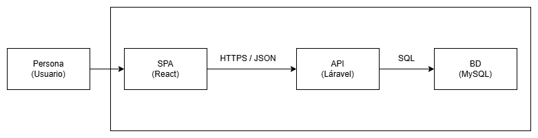

# Arquitectura de TaskFlow

> Este archivo es parte de la Tarea 2 del curso (se asigna al cierre de la Sesión 2, se entrega en la Sesión 4).

## Diagrama

}

- **Persona (Usuario)**: Usuario final que interactúa con la aplicación.
- **SPA (React)**: Interfaz de usuario frontend, construida con React y Vite.
- **API (Laravel)**: Backend que maneja la lógica de negocio, autenticación y operaciones CRUD.
- **Base de Datos (MySQL)**: Almacenamiento persistente de datos del sistema.

## Decisiones de arquitectura

- **Arquitectura desacoplada (API-first):** TaskFlow utiliza una arquitectura desacoplada donde el backend (Laravel) actúa exclusivamente como API REST, separando completamente la lógica del servidor de la interfaz de usuario. Esta decisión permite que el frontend (React) sea independiente del backend, facilitando el desarrollo, mantenimiento y escalabilidad. Además, el mismo backend puede servir a múltiples clientes (web, móvil, etc.) sin modificaciones.

- **Capas del backend:** El backend se organiza en tres capas principales:
  - **Presentación (Rutas/Controladores):** Maneja las solicitudes HTTP, valida datos de entrada y devuelve respuestas JSON.
  - **Lógica de negocio (Modelos/Servicios):** Contiene la lógica de la aplicación(modelos o servicios).
  - **Acceso a datos (Eloquent/Migraciones):** Utiliza Eloquent para interactuar con la base de datos, y las migraciones permiten versionar y mantener la estructura de la base de datos de manera controlada.